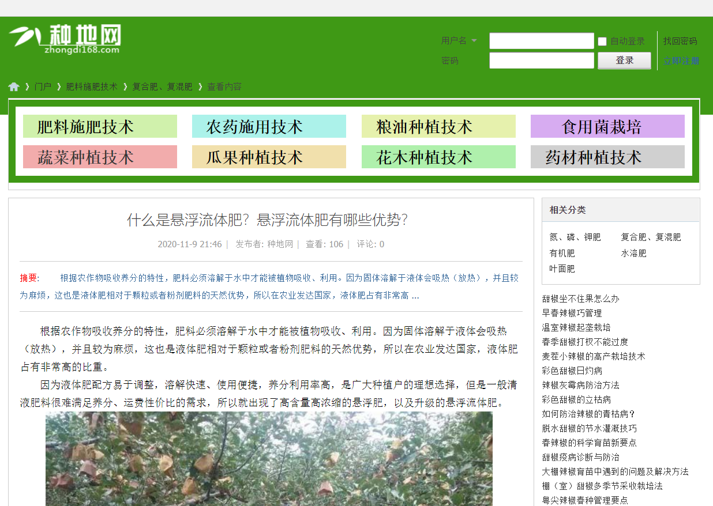

# pyspyderInFarm
## 可以干什么？
### 可以爬取[种地网](http://www.zhongdi168.com/)上所有的问答的文本

## 所需的第三方库
* BeautifulSoup 4
* lxml
* tqdm
## 如何使用？
### 文件中**index.py**为实例用法，在**spider.py**中有方法注释
## 未来改进
* 添加更新内容方法
* 添加爬取图片方法

## 算是第一次用Git往远程库放东西^v^